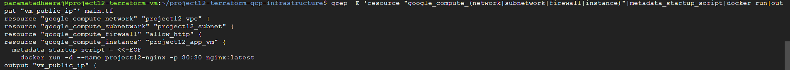
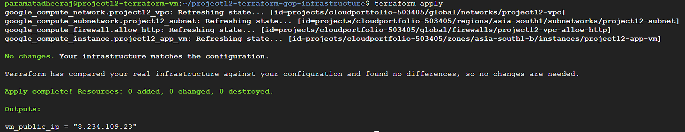
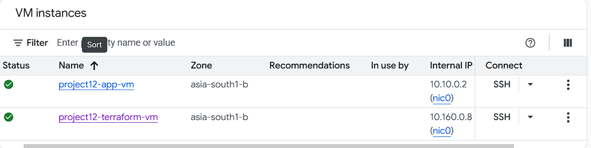
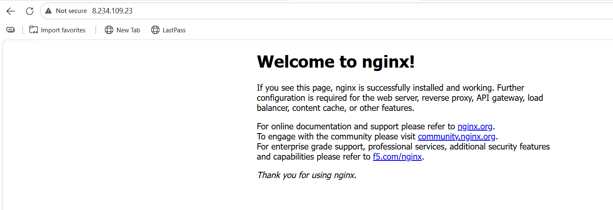
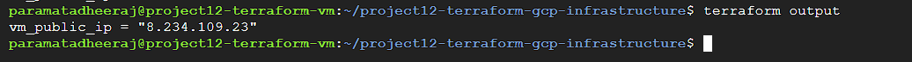

# Terraform Infrastructure as Code on Google Cloud

## 📌 Project Overview

This project demonstrates how to use **Terraform Infrastructure as Code (IaC)** to provision and manage infrastructure on **Google Cloud Platform (GCP)**.

Instead of manually creating cloud resources through the GCP Console, Terraform is used to define the infrastructure in configuration files and deploy it automatically.

The project creates a complete web application infrastructure consisting of:

- Google Cloud VPC Network
- Custom Subnet
- HTTP Firewall Rule
- Compute Engine VM
- Docker
- Nginx Web Server

The Nginx application is automatically installed and started on the Compute Engine VM using a Terraform startup script.

---

## 🏗️ Architecture

```text
                    Terraform
                        │
                        ▼
                Google Cloud Platform
                        │
                        ▼
                 project12-vpc
                        │
                        ▼
                project12-subnet
                  10.10.0.0/24
                        │
                        ▼
              Compute Engine VM
               project12-app-vm
                        │
                        ▼
                      Docker
                        │
                        ▼
                  Nginx Container
                        │
                        ▼
                  HTTP Port 80
                        │
                        ▼
                   Web Browser
```

---

## 🛠️ Technologies Used

| Technology | Purpose |
|---|---|
| Terraform | Infrastructure as Code |
| Google Cloud Platform | Cloud infrastructure |
| Compute Engine | Virtual machine |
| VPC | Network infrastructure |
| Subnet | Private IP network |
| Firewall | HTTP traffic control |
| Docker | Container platform |
| Nginx | Web server |
| Debian 12 | VM operating system |
| Git | Version control |
| GitHub | Source code repository |

---

## ☁️ Google Cloud Configuration

### GCP Project

```text
Project ID: cloudportfolio-503405
```

### Region

```text
asia-south1
```

### Zone

```text
asia-south1-b
```

### Machine Type

```text
e2-medium
```

### Operating System

```text
Debian 12
```

---

# 📦 Infrastructure Created

Terraform provisions the following resources.

## 1. VPC Network

A custom VPC network is created using Terraform.

```text
project12-vpc
```

The VPC uses:

```hcl
auto_create_subnetworks = false
```

This allows the subnet configuration to be managed explicitly.

---

## 2. Custom Subnet

A custom subnet is created inside the VPC.

```text
Name: project12-subnet
Region: asia-south1
CIDR: 10.10.0.0/24
```

The subnet provides the internal network for the Compute Engine VM.

---

## 3. Firewall Rule

Terraform creates an HTTP firewall rule:

```text
project12-vpc-allow-http
```

The rule allows:

```text
Protocol: TCP
Port: 80
Source: 0.0.0.0/0
```

This allows users to access the Nginx web server through HTTP.

---

## 4. Compute Engine VM

Terraform creates the application VM:

```text
project12-app-vm
```

Configuration:

```text
Machine Type: e2-medium
OS: Debian 12
Disk: 20 GB
Zone: asia-south1-b
```

The VM receives an ephemeral public IP address.

---

# 🐳 Docker Deployment

The VM automatically installs Docker through the Terraform startup script.

The startup script performs the following operations:

```bash
apt-get update
apt-get install -y docker.io
systemctl enable docker
systemctl start docker
```

After Docker is installed, Terraform starts an Nginx container:

```bash
docker run -d --name project12-nginx -p 80:80 nginx:latest
```

The container exposes:

```text
VM Port 80 → Docker Port 80 → Nginx
```

---

# 🌐 Nginx Web Application

Nginx runs inside a Docker container.

Container name:

```text
project12-nginx
```

Port mapping:

```text
80:80
```

After deployment, the Nginx welcome page can be accessed through the VM's public IP address.

Example:

```text
http://<VM_PUBLIC_IP>
```

The browser displays:

```text
Welcome to nginx!
```

---

# 📁 Project Structure

```text
project12-terraform-gcp-infrastructure/
│
├── main.tf
├── variables.tf
├── terraform.tfvars
├── .terraform.lock.hcl
├── .gitignore
├── README.md
│
└── screenshots/
    ├── 01-terraform-code.png
    ├── 02-terraform-apply.png
    ├── 03-gcp-vm.png
    ├── 04-nginx.png
    └── 05-terraform-output.png
```

> `terraform.tfvars`, Terraform state files, and the `.terraform` directory are excluded from Git using `.gitignore`.

---

# ⚙️ Terraform Configuration

Terraform uses variables to make the infrastructure reusable.

Example:

```hcl
variable "project_id" {
  description = "GCP Project ID"
  type        = string
}

variable "region" {
  description = "GCP region"
  type        = string
  default     = "asia-south1"
}

variable "zone" {
  description = "GCP zone"
  type        = string
  default     = "asia-south1-b"
}

variable "machine_type" {
  description = "Compute Engine machine type"
  type        = string
  default     = "e2-medium"
}
```

---

# 🚀 Terraform Workflow

The project follows the standard Terraform workflow:

```text
Write Configuration
        ↓
terraform init
        ↓
terraform validate
        ↓
terraform plan
        ↓
terraform apply
        ↓
Google Cloud Infrastructure
```

---

## 1. Initialize Terraform

```bash
terraform init
```

This downloads the required Google Cloud provider.

---

## 2. Validate Configuration

```bash
terraform validate
```

This checks the Terraform configuration for syntax and configuration errors.

Expected result:

```text
Success! The configuration is valid.
```

---

## 3. Format Configuration

```bash
terraform fmt
```

This formats the Terraform files according to Terraform's standard style.

---

## 4. Create Execution Plan

```bash
terraform plan
```

Terraform shows the resources that will be created, modified, or destroyed.

---

## 5. Deploy Infrastructure

```bash
terraform apply
```

Confirm the deployment when Terraform asks:

```text
Enter a value: yes
```

Terraform then creates the GCP infrastructure.

---

# 📤 Terraform Output

Terraform exposes the VM's public IP through an output variable.

```hcl
output "vm_public_ip" {
  description = "Public IP address of the Terraform-created VM"
  value       = google_compute_instance.project12_app_vm.network_interface[0].access_config[0].nat_ip
}
```

The public IP can be displayed using:

```bash
terraform output
```

Example:

```text
vm_public_ip = "8.234.109.23"
```

The actual IP address may change if the VM is recreated.

---

# 🧪 Application Testing

After Terraform completes the deployment, the Nginx application can be tested using:

```bash
curl http://<VM_PUBLIC_IP>
```

A successful response contains:

```text
Welcome to nginx!
```

The application can also be opened in a browser:

```text
http://<VM_PUBLIC_IP>
```

---

# 📸 Project Screenshots

## 1. Terraform Configuration

Terraform infrastructure configuration showing the VPC, subnet, firewall, VM, and Docker/Nginx startup script.



---

## 2. Terraform Apply

Terraform successfully creating the Google Cloud infrastructure.



---

## 3. Google Cloud VM

The Compute Engine VM created by Terraform.



---

## 4. Nginx Web Application

Nginx successfully running inside the Docker container.



---

## 5. Terraform Output

Terraform displaying the public IP address of the VM.



---

# 🔄 Infrastructure Lifecycle

One of the major benefits of Terraform is that infrastructure can be managed through code.

### Create

```bash
terraform apply
```

### Review

```bash
terraform plan
```

### Modify

Update the Terraform configuration and run:

```bash
terraform apply
```

### Destroy

The entire Terraform-managed infrastructure can be removed with:

```bash
terraform destroy
```

This demonstrates the Infrastructure as Code lifecycle:

```text
Create → Manage → Modify → Destroy
```

---

# 🔐 Security and Configuration

The project uses a `.gitignore` file to prevent Terraform state and local configuration files from being uploaded to GitHub.

Excluded files include:

```text
.terraform/
*.tfstate
*.tfstate.*
*.tfvars
```

The Terraform provider lock file is retained:

```text
.terraform.lock.hcl
```

This helps maintain consistent provider versions.

---

# 📚 What I Learned

Through this project, I practiced:

- Infrastructure as Code
- Terraform fundamentals
- Terraform providers
- Terraform resources
- Terraform variables
- Terraform outputs
- Terraform state
- Terraform initialization
- Terraform validation
- Terraform planning
- Terraform deployment
- Google Cloud VPC creation
- Custom subnet configuration
- Firewall configuration
- Compute Engine provisioning
- Docker installation using startup scripts
- Nginx container deployment
- Git and GitHub integration
- Infrastructure lifecycle management

---

# 🎯 Project Objective

The main objective of this project is to demonstrate how cloud infrastructure can be created and managed using **Terraform instead of manually configuring resources through the cloud console**.

This project combines:

```text
Cloud
+
Infrastructure as Code
+
Networking
+
Virtual Machines
+
Docker
+
Nginx
```

into a single practical DevOps project.

---

# 📌 Project Status

```text
✅ Terraform installed
✅ Google Cloud provider configured
✅ VPC created
✅ Subnet created
✅ Firewall configured
✅ Compute Engine VM created
✅ Docker installed automatically
✅ Nginx container deployed
✅ Web application tested
✅ Terraform output configured
✅ Git repository created
```

---

# 🔗 GitHub Repository

**Repository:**

`Dheerajparamata/project12-terraform-gcp-infrastructure`

---

# 👨‍💻 Author

**Dheeraj Paramata**

DevOps / Cloud Computing Learner

### Skills demonstrated in this project

```text
AWS
Azure
Google Cloud
Terraform
Docker
Kubernetes
Git
GitHub
Jenkins
Ansible
Linux
CI/CD
Infrastructure as Code
```

---

## ⭐ Conclusion

This project demonstrates a complete Infrastructure as Code workflow using Terraform on Google Cloud.

Terraform provisions the network infrastructure and Compute Engine VM, while the VM startup script installs Docker and launches an Nginx container automatically.

The result is a reproducible cloud infrastructure deployment that can be created, managed, modified, and destroyed using Terraform commands.
